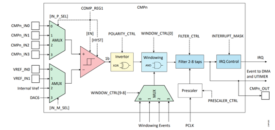
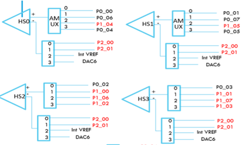

.. _appnote-zephyr-alif-cmp:

===
CMP
===

Introduction
============

This application note describes digital control to process data from the Analog Comparator.

- The **High-Speed Comparator (CMP)** module is a rail-to-rail, multi-input, analog comparator with programmable reference voltage and hysteresis.
- Reference voltage can be sourced from:
  - DAC6,
  - Internal VREF, or
  - External pins.
- **Programmable hysteresis**: from 0 mV to 45 mV.
- **Comparator result inverter** (polarity control).
- **Configurable number of taps** for digital filtering.
- **Interrupt generation** after filtering is applied.

High Speed Comparator
-----------------------

    CMP Block Diagram

- The HSCMP compares the voltages at its two inputs (i.e., the positive and negative terminal voltages).
  If the **positive input voltage** is greater than the **negative input voltage**, the comparator outputs a **logic 1 (high)**.
  Otherwise, it outputs a **logic 0 (low)**.

- When the two input voltages are very close, the comparator output may oscillate rapidly due to noise or minor fluctuations.
  To prevent this, the HSCMP includes **programmable hysteresis** (from 0 mV to 45 mV), which introduces a voltage threshold gap between rising and falling transitions.

- **Polarity control** allows the comparator output to be inverted as needed.

- **Filter control** provides digital filtering with a configurable number of taps to suppress high-frequency glitches and ensure stable output transitions.

Hardware Requirements and Setup
===============================

Comparator Register:
--------------------

.. list-table::
   :header-rows: 1
   :widths: 25 10 10 55

   * - Register
     - Offset
     - Access
     - Description
   * - ``CMP_COMP_REG1``
     - 0x0
     - R/W
     - Comparator Register 1
   * - ``CMP_COMP_REG2``
     - 0x4
     - R/W
     - Comparator Register 2
   * - ``CMP_POLARITY_CTRL``
     - 0x8
     - R/W
     - CMP Polarity Control Register
   * - ``CMP_WINDOW_CTRL``
     - 0xC
     - R/W
     - CMP Window Control Register
   * - ``CMP_FILTER_CTRL``
     - 0x10
     - R/W
     - CMP Filter Control Register
   * - ``CMP_PRESCALER_CTRL``
     - 0x14
     - R/W
     - CMP Prescaler Control Register
   * - ``CMP_STATUS``
     - 0x18
     - R
     - CMP Status Register
   * - ``CMP_INTERRUPT_STATUS``
     - 0x20
     - W1C
     - CMP Interrupt Status and Clear Register
   * - ``CMP_INTERRUPT_MASK``
     - 0x24
     - R/W
     - CMP Interrupt Mask Register

Analog Comparator Inputs
--------------------------

    Analog Comparator Inputs

Hardware Setup
---------------

- **For the CMP0 instance**:
  The user can select one of the following pins as the **positive input terminal**:
  ``P0_0``, ``P0_6``, ``P1_4``, or ``P0_4``.

  The **negative input terminal** can be selected from:
  ``P2_0``, ``P2_1``, **Internal VREF**, or **DAC6**.

  The same pin options apply to other CMP instances (CMP1–CMP3).

- **Wiring for testing**:
  Use a wire to connect **P0_0** (configured as the positive terminal) to **P12_3** (LED output, labeled on header **J14**).

- **Negative terminal configuration**:
  Configure the negative input as **DAC6**, which is internally set to **0.8 V**.
  No external hardware connection is required for this reference voltage.

- **Prerequisite**:
  The **LED Blinky application** must be running on the board, with **P12_3 toggling every 1 second** (i.e., 1 Hz square wave).

- **Comparator output observation**:
  Monitor the following pins for comparator outputs:

  - **CMP0 output**: ``P14_7``
  - **CMP1 output**: ``P14_6``
  - **CMP2 output**: ``P14_5``
  - **CMP3 output**: ``P14_4``

Analog Comparator Operation
=============================

Comparator Configuration Steps
--------------------------------

1. **Configure ``COMP_REG1``**:
   - Select the **positive input terminal**, **negative input terminal**, and set **hysteresis to 45 mV**.

2. **Enable High-Speed Comparators** in ``COMP_REG1``:
   - **Bit 28**: Enable for ``COMPHS0``
   - **Bit 29**: Enable for ``COMPHS1``
   - **Bit 30**: Enable for ``COMPHS2``
   - **Bit 31**: Enable for ``COMPHS3``

3. **Polarity Control** (register ``CMP_POLARITY_CTRL`` at offset ``0x08``):
   - Write ``0x1`` to **invert** the ``Comp_in`` signal.
   - If set to ``0x0``, ``Comp_in`` passes **directly** (via synchronizer) without inversion before sampling.

4. **Filter Control** (register ``CMP_FILTER_CTRL`` at offset ``0x10``):

   Write value ``0x0501``:

   - **Bit [0] = 1**: Enables digital filtering.
   - **Bits [11:8] = 0x5**: Requires ``Comp_in`` to be **stable for 5 consecutive samples** with a different value than ``Comp_out`` before updating ``Comp_out``.

5. **Prescaler Control** (register ``CMP_PRESCALER_CTRL`` at offset ``0x14``):
   - Write ``0x8`` → Comparator input is sampled **every 8 system clocks** (i.e., at clocks 0, 8, 16, 24, 32, …).
   - Samples at intermediate clocks are **ignored**.

Example: Using CMP0 Instance
------------------------------

1. In ``devicetree``, configure input muxes for **CMP0** node.
2. Set **positive input** via:
   ``CMP_POS_IN0`` → selects analog pin **P0_0**.
3. Set **negative input** via:
   ``CMP_NEG_IN3`` → uses **DAC6** as internal 0.8 V reference.
4. **Hardware setup**: Connect **P0_0** to **P12_3** (labeled LED output on header **J14**).
5. **DAC6** is internally configured to **0.8 V**—no external wiring needed for the negative input.
6. **Prerequisite**: The **LED Blinky application** must be running, causing **P12_3 to toggle every 1 second** (1 Hz square wave).

This setup allows the comparator to detect the toggling signal on P0_0 (driven by the LED output) against a stable 0.8 V threshold, with filtering and hysteresis ensuring clean output transitions.

.. include:: prerequisites.rst

.. include:: note.rst

Building an CMP Application with Zephyr
========================================

Follow these steps to build the CMP application using the Alif Zephyr SDK:

1. For instructions on fetching the Alif Zephyr SDK and navigating to the Zephyr repository, please refer to the `ZAS User Guide`_

.. note::
   The build commands shown here are specifically for the Alif E7 DevKit.
   To build the application for other boards, modify the board name in the build command accordingly. For more information, refer to the `ZAS User Guide`_, under the section Setting Up and Building Zephyr Applications.

2. Build commands for applications on the M55 HE core:

.. code-block:: bash

   west build -p always -b alif_e7_dk/ae722f80f55d5xx/rtss_he ../alif/samples/drivers/cmp -S alif-cmp

3. Build commands for applications on the M55 HP core:

.. code-block:: bash

   west build -p always -b alif_e7_dk/ae722f80f55d5xx/rtss_hp ../alif/samples/drivers/cmp -S alif-cmp

Once the build command completes successfully, executable images will be generated and placed in the `build/zephyr` directory. Both `.bin` (binary) and `.elf` (Executable and Linkable Format) files will be available.

Executing Binary on the DevKit
===============================

To execute binaries on the DevKit follow the command

.. code-block:: bash

   west flash

CMP Console Output
====================

The following log is observed during execution of the Analog Comparator (CMP) application:

.. code-block:: console

    [00:00:02.000,000] <inf> ALIF_CMP: start comparing
    [00:00:02.050,000] <inf> ALIF_CMP: positive input voltage is greater than negative input voltage
    [00:00:02.101,000] <inf> ALIF_CMP: negative input voltage is greater than the positive input voltage
    [00:00:02.151,000] <inf> ALIF_CMP: positive input voltage is greater than negative input voltage
    [00:00:02.201,000] <inf> ALIF_CMP: negative input voltage is greater than the positive input voltage
    [00:00:02.251,000] <inf> ALIF_CMP: positive input voltage is greater than negative input voltage
    [00:00:02.301,000] <inf> ALIF_CMP: negative input voltage is greater than the positive input voltage
    [00:00:02.351,000] <inf> ALIF_CMP: positive input voltage is greater than negative input voltage
    [00:00:02.401,000] <inf> ALIF_CMP: negative input voltage is greater than the positive input voltage
    [00:00:02.451,000] <inf> ALIF_CMP: positive input voltage is greater than negative input voltage
    [00:00:02.501,000] <inf> ALIF_CMP: negative input voltage is greater than the positive input voltage
    [00:00:02.501,000] <inf> ALIF_CMP: Comparison Completed

LPCMP Console Output
======================

.. code-block:: console

    [00:00:02.000,000] <inf> ALIF_CMP: start comparing
    [00:00:02.501,000] <inf> ALIF_CMP: Comparison Completed

