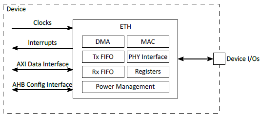

.. _appnote-ethernet:

=========
Ethernet
=========

Introduction
============

This application note provides a comprehensive guide for configuring and testing Ethernet functionality in Zephyr RTOS using its built-in networking stack. It outlines the steps required to set up the Ethernet driver, obtain an IP address via DHCP, and perform basic network operations such as ping.

The Ethernet Controller (ETH) module delivers a robust, high-speed Ethernet interface for embedded systems, compliant with the IEEE 802.3-2008 standard. It features a Reduced Media Independent Interface (RMII) for connection to external PHY devices and supports both full-duplex and half-duplex operation. Additional capabilities include hardware flow control and checksum offloading to enhance network performance and reduce CPU overhead.

Key Features
------------

- **Data Transfer Rates:** Supports 10/100 Mbps operation via the Reduced Media Independent Interface (RMII), with automatic CRC generation and frame padding in accordance with IEEE 802.3 standards.

- **Flow Control:** Implements automatic pause frame generation for full-duplex mode and backpressure signaling for half-duplex mode to manage network congestion.

- **Checksum Offloading:** Provides hardware acceleration for verifying IPv4, TCP, UDP, and ICMP checksums, significantly reducing CPU utilization.

- **FIFO Management:** Features configurable transmit and receive FIFOs with programmable watermark thresholds to optimize throughput and latency.

- **Error Handling:** Automatically retransmits frames lost due to collisions and discards malformed or erroneous frames to maintain data integrity and link reliability.

- **PHY Configuration:** Supports configuration and status monitoring of external PHY devices through the Management Data Input/Output (MDIO) interface, enabling flexible PHY integration.

Zephyr Networking Stack Overview
================================

The Zephyr networking stack is designed to deliver efficient and scalable networking capabilities for resource-constrained embedded devices. It provides robust support for a wide range of standard network protocols, including IPv4, IPv6, TCP, UDP, and Ethernet, enabling seamless connectivity in diverse embedded applications.

Key Features of the Zephyr Networking Stack
-------------------------------------------

1. **Protocol Support:**

   - TCP (Transmission Control Protocol)
   - UDP (User Datagram Protocol)
   - ICMP (Internet Control Message Protocal)
   - IPv4/IPv6 (Internet Protocol)
   - DHCP (Dynamic Host Configuration Protocol)
   - DNS (Domain Name Server Protocal)
   - ARP (Address Resolution Protocol)

2. **Modular Configuration:**
   - Developers can enable or disable specific features via Kconfig (typically in ``prj.conf``), minimizing the memory footprint.

3. **Device Tree Integration:**
   - Zephyr’s networking stack relies on the Device Tree to configure hardware components such as the Ethernet MAC, PHY, and MDIO interface.

4. **Shell and Debugging Tools:**
   - The stack provides tools such as ``net-shell`` for inspecting network interfaces, IP routes, and statistics at runtime.

How the Networking Stack Works
------------------------------

1. **Initialization:**
   - The networking subsystem initializes during boot based on configuration settings in the ``prj.conf`` file and hardware details specified in the device tree. Network interfaces, such as Ethernet, are automatically brought up if enabled and properly configured.

2. **Interface Management:**
   - The stack maintains a list of active network interfaces (e.g., Ethernet, Wi-Fi) and assigns IP addresses to them via DHCP or static configuration.

3. **Packet Processing:**
   - Incoming and outgoing packets traverse a layered networking stack:

     - **Application Layer:** Implements application-level protocols such as HTTP, MQTT, or CoAP.
     - **Transport Layer:** Handles end-to-end communication using protocols like TCP or UDP.
     - **Network Layer:** Manages logical addressing and routing via IPv4 or IPv6.
     - **Link Layer:** Interfaces with the physical network medium (e.g., Ethernet) for frame transmission and reception.

4. **IP Address Management:**
   - For dynamic IP assignment, the DHCP client requests an IP address during network initialization. Static IP configuration is also supported for deterministic or fixed-address setups.

5. **Socket API:**
   - Zephyr provides a POSIX-compliant socket API for easy integration with standard networking applications.

Here’s how the networking stack processes a simple ping operation:
-------------------------------------------------------------------

1. **Host Initiates Ping**
   - The host sends an ICMP Echo Request packet to the device.

2. **Reception**
   - The Ethernet driver receives the incoming frame and passes it up to the networking stack.

3. **Processing**
   - The networking stack processes the packet at the IP layer, identifies it as an ICMP Echo Request, and validates.
   - It then constructs a corresponding ICMP Echo Reply packet.

4. **Transmission**
   - The stack hands the reply packet back to the Ethernet driver for transmission to the host.

ETH Overview
--------------

   ETH Overview

- **DMA (Direct Memory Access):**
  - Handles data transfers between system memory and the **Tx/Rx FIFOs** with minimal CPU involvement.

- **Transmit Path:**
  - Data flows from system memory → DMA → Tx FIFO → MAC → PHY interface → Network.

- **Receive Path:**
  - Data flows from the network → PHY interface → MAC → Rx FIFO → DMA → System memory.

- **MAC and PHY Interface:**
  - The MAC handles Ethernet frame processing, while the PHY interface connects to an external PHY chip for physical-layer communication over the Ethernet cable.

- **Interrupts:**
  - Generated for events such as transmission or reception completion, or errors, to notify the CPU for appropriate handling.

DTS configuration for Ethernet
-------------------------------

.. code-block:: dts

   ethernet: ethernet@48100000 {
       compatible = "alif,ethernet", "snps,designware-ethernet";
       reg = <0x48100000 0x1000>;
       pinctrl-0 = <&pinctrl_eth>;
       pinctrl-names = "default";
       interrupts = <148 3>;
       clocks = <&clockctrl ALIF_ETHERNET_CLK>;
       local-mac-address = [02 01 56 78 43 21];
       status = "disabled";

       mdio: mdio {
           compatible = "snps,designware-mdio";
           #address-cells = <1>;
           #size-cells = <0>;
           status = "disabled";

           ethernet_phy@1 {
               compatible = "realtek,rtl8201fr";
               reg = <1>;
               phy_mode = "PHY_AUTO_NEGOTIATE";
               status = "disabled";
           };
       };
   };

The DTS configuration for Ethernet is as follows:

- The MAC address is provided in the DTS entry using the ``local-mac-address`` property.
- By default, auto-negotiation mode is enabled. If the user wants to change the PHY mode, they can specify either full-duplex or half-duplex by setting ``phy_mode = "PHY_FULL_DUPLEX"`` or ``phy_mode = "PHY_HALF_DUPlex"``, respectively.
- The PHY speed can also be configured. Users can set the speed to 10 Mbps or 100 Mbps by using ``phy_speed = "PHY_SPEED_10M"`` or ``phy_speed = "PHY_SPEED_100M"``, respectively.
- To configure the PHY speed, add the property ``phy_speed = "PHY_SPEED_100M";`` in the ``ethernet_phy`` node.

.. include:: prerequisites.rst

.. include:: note.rst

Building an Ethernet DHCP Client Application with Zephyr
==========================================================

Follow these steps to build the Ethernet DHCP Client application using the Alif Zephyr SDK:

1. For instructions on fetching the Alif Zephyr SDK and navigating to the Zephyr repository, please refer to the `ZAS User Guide`_.

.. note::
   The build commands shown here are specifically for the Alif E7 DevKit.
   To build the application for other boards, modify the board name in the build command accordingly. For more information, refer to the `ZAS User Guide`_, under the section Setting Up and Building Zephyr Applications.

2. Build commands for applications on the M55 HE core:

.. code-block:: bash

    west build -p always -b alif_e7_dk/ae722f80f55d5xx/rtss_he samples/net/dhcpv4_client/

3. Build commands for applications on the M55 HP core:

.. code-block:: bash

    west build -p always -b alif_e7_dk/ae722f80f55d5xx/rtss_hp samples/net/dhcpv4_client/

Once the build command completes successfully, executable images will be generated and placed in the `build/zephyr` directory. Both `.bin` (binary) and `.elf` (Executable and Linkable Format) files will be available.

Executing Binary on the DevKit
===============================

To execute binaries on the DevKit, follow the command:

.. code-block:: bash

    west flash

Procedure to Test DHCP Client Application
==========================================

- Ensure ``CONFIG_NET_DHCPV4`` is enabled in ``prj.conf`` to enable DHCP client support.

- Ensure the MAC address and PHY configuration are correctly set in the Device Tree Source (DTS) file.

- Build and flash the application to the target hardware (Ensemble DevKit).

- Connect the device to a network that includes an active DHCP server using an Ethernet cable.

- Ensure the DHCP server is running and capable of assigning an IP address to the client device.

- Power on the device and monitor the logs. The DHCP client will send a request to the DHCP server to obtain an IP address.

- Check the logs for messages indicating successful IP address assignment: Example log output:

.. code-block:: text

   [00:00:03.500,000] <info> dwmac_core: HW version 5.10

   [00:00:03.500,000] <info> net_dhcpv4_client_sample: Run dhcpv4 client
   [00:00:03.500,000] <info> net_dhcpv4_client_sample: Start on ethernet@48100000: index=1
   [00:00:10.524,000] <info> net_dhcpv4: Received: 10.10.4.16
   [00:00:10.524,000] <info> net_dhcpv4_client_sample: Address[1]: 10.10.4.16
   [00:00:10.525,000] <info> net_dhcpv4_client_sample: Subnet[1]: 255.255.255.0
   [00:00:10.525,000] <info> net_dhcpv4_client_sample: Router[1]: 10.10.4.1
   [00:00:10.525,000] <info> net_dhcpv4_client_sample: Lease time[1]: 6000000 seconds
   uart:~$

- If no IP address is assigned, ensure the DHCP server is correctly configured and reachable on the network.

- To test connectivity, use a tool like ``ping`` from another device on the same network: ``ping 10.10.4.16``.

.. code-block:: text

   nisarga@nisarga:~/Zephyr_v3.6_up/LLVMEmbeddedToolchainForArm-17.0.1-Linux-x86_64$ ping 10.10.4.16
   PING 10.10.4.16 (10.10.4.16) 56(84) bytes of data.
   64 bytes from 10.10.4.16: icmp_seq=1 ttl=64 time=0.416 ms
   64 bytes from 10.10.4.16: icmp_seq=2 ttl=64 time=0.267 ms
   64 bytes from 10.10.4.16: icmp_seq=3 ttl=64 time=0.225 ms
   64 bytes from 10.10.4.16: icmp_seq=4 ttl=64 time=0.263 ms
   ^C
   --- 10.10.4.16 ping statistics ---
   4 packets transmitted, 4 received, 0% packet loss, time 3057ms
   rtt min/avg/max/mdev = 0.225/0.292/0.416/0.073 ms

- Use tools like **Wireshark** to capture and analyze DHCP packets to verify that the client is sending requests and receiving responses.

