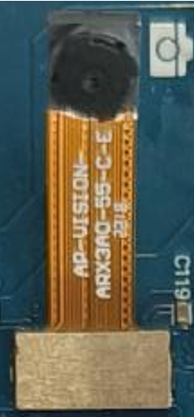
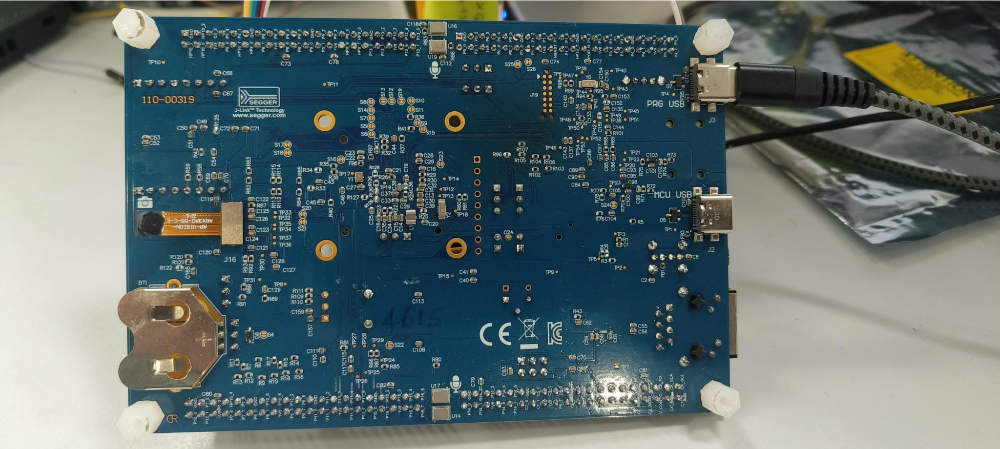

.. _isp:

===
ISP
===

Introduction
============

This application note describes how to capture camera frames using the ISP instances of the video driver with the ARX3A0 camera sensor.

**Image data path**:
CMOS sensor →CSI bus controller → CPI → ISP → Memory

Hardware Requirements
======================

CPI
----

The CPI IP, provided by Alif Semiconductor, captures video frames and stores them in an allocated memory area. It can also forward the frames to the ISP IP from VeriSilicon, which is integrated into the Alif SoC.

MIPI DPHY
-------------

The MIPI DPHY physical layer receives serial input data from the camera sensor and transfers it to the MIPI CSI-2 host. Key features of the DPHY include:

- **Flexible clock configuration**: Supports a clock frequency range of 17 MHz to 52 MHz.
- **Lane operation**: Supports data rates from 80 Mbps to 2.5 Gbps per lane in the forward direction.
- **Aggregate throughput**: Capable of up to 10 Gbps with four data lanes in the forward direction.
- **Maximum low-power (LP) data rate**: Supports up to 10 Mbps.
- **PHY-Protocol Interface (PPI)**: Used for communication between the PHY and the protocol layer for clock and data lanes.
- **Low-power modes**: Supports low-power escape modes and an Ultra-Low-Power (ULP) state for improved energy efficiency.
- **High-Speed (HS) TX and RX features**: Includes programmable HS transmitter amplitude levels, automatic deskew calibration, equalization, and offset cancellation.
- **Internal pattern checker**: Built-in for testing and verification purposes.

This comprehensive set of features enables the D-PHY physical layer to efficiently handle a wide range of data rates and power modes while maintaining signal integrity and robust communication performance.

MIPI CSI2
------------

The MIPI CSI2 interface performs unpacking of serial input data according to the configured pixel data type. It conveys the unpacked pixel data and generates accurately timed video synchronization signals via the Image Pixel Interface (IPI).

Key features of MIPI CSI2 include:

- **Combo PHY Support**: Utilizes up to four RX data lanes on D-PHY.
- **High Data Rate**: Supports data rates of up to 2.5 Gbps per lane in D-PHY mode.
- **Data Format Flexibility**: Compatible with a wide range of primary and secondary data formats, including YUV, RGB, RAW, and user-defined byte-based formats.
- **Robust Error Detection and Correction**: Implements mechanisms at multiple levels—PHY, packet, line, and frame—to ensure reliable data transmission.

These features enable MIPI CSI2 to efficiently handle diverse pixel data formats, maintain precise synchronization, and deliver robust, error-resilient communication for image sensors.

I2C Controller
--------------

The I2C controller is an IP block provided by Alif Semiconductor and facilitates communication between the SoC and the ARX3A0 camera sensor.

ARX3A0 Camera Sensor: IAS1MOD - ARX3A0CSSC090110 - GEVB
----------------------------------------------------------

The camera sensor used is the ARX3A0, a significant advancement in CMOS imaging technology. Engineered to be remarkably compact—with a 1/10-inch optical format—and exceptionally energy-efficient, the ARX3A0 opens up innovative possibilities for IoT devices. It offers an active resolution of 560 × 560 pixels and can achieve a high frame rate of 360 frames per second.

    ARX3A0 Camera Sensor

VeriSilicon ISP Pico 8000L ISP
------------------------------

The VeriSilicon Vivante ISP IP is a full-featured image signal processor (ISP) capable of supporting a wide range of image processing functions.

The ISPPico, part of the Vivante ISP IP family, is a complete video and still-image input unit designed for ultra-low power consumption and minimal silicon area. It provides essential image processing capabilities and supports both:

- Simple CMOS sensors that output an RGB Bayer pattern (without integrated image processing), and
- Image sensors with built-in YUV processing.

The IP accepts sensor input via the DVP interface and can be directly connected to other IP blocks—such as the CPI block on Alif SoCs. Image data is transferred through a memory interface to an AXI bus system, while register programming is performed via an AHB slave interface.

Designed for seamless integration into SoCs, the ISP achieves low power consumption and a small silicon footprint for its class. Dynamic power consumption is minimized through extensive use of multi-level hierarchical clock gating, and leakage power is reduced by employing low-leakage, low-power standard cells.

Hardware Connections
======================

ARX3A0 Sensor and Flat Board Connection
-------------------------------------------

    Flat Board with Standard connection

Camera GPIO Configuration (B0 Flat Board)
------------------------------------------

- **P0_3**: Configured as ``CAM_XVCLK_A``.

I2C GPIO Configuration
-----------------------

- **P7_2**: Configured as ``I2C1_SDA_C``.
- **P7_3**: Configured as ``I2C1_SCL_C``.

Required Configuration Features
===============================

Video Sub-System Configs
------------------------

.. code-block:: kconfig

   CONFIG_VIDEO=y
   CONFIG_VIDEO_MIPI_CSI2_DW=y
   CONFIG_LOG=y
   CONFIG_PRINTK=y
   CONFIG_STDOUT_CONSOLE=y
   CONFIG_I2C_TARGET=y
   CONFIG_I2C=y
   CONFIG_I2C_DW_CLOCK_SPEED=100

ISP Configs
-----------

.. code-block:: kconfig

   CONFIG_USE_ALIF_ISP_LIB=y
   CONFIG_ISP_LIB_SCALAR_MODULE=y
   CONFIG_ISP_LIB_DMSC_MODULE=y

The above ISP configuration enables **Scalar** and **Demosaicing** functionality from the ISP IP.

Software Requirements for ISP Application
=========================================

To successfully run the MIPI camera application, you’ll need the following software components and drivers:

- **Alif SDK**: Clone from `https://github.com/alifsemi/sdk-alif.git <https://github.com/alifsemi/sdk-alif.git>`_
- **West Tool**: For building Zephyr applications (refer to the `ZAS User Guide`_)
- **Arm GCC Compiler**: For compiling the application (part of the Zephyr SDK)
- **SE Tools**: For loading binaries (refer to the `ZAS User Guide`_)

Camera Drivers (MIPI Interface)
--------------------------------

- Alif Zephyr MIPI CSI2 Driver
- Alif Zephyr Video Driver
- Alif Zephyr MIPI DSI Driver
- Alif Zephyr MIPI DPHY Driver
- Alif Zephyr ISP Driver
- Alif Zephyr ISP HAL Driver

ARX3A0 Camera Sensor Driver
---------------------------

- Zephyr I2C DesignWare Driver
- Alif Zephyr ARX3A0 Camera Sensor Driver

Selected ARX3A0 Camera Sensor Configurations
--------------------------------------------

- **Interface**: MIPI CSI2
- **Resolution**: 560×560
- **Output Format**: RAW Bayer10

Selected ISP Configurations
---------------------------

- **Resolution**: 480×480
- **Output Format**: RGB888 planar

.. include:: note.rst

Building an ISP Application with Zephyr
========================================

Follow these steps to build the ISP application using the Alif Zephyr SDK:

1. For instructions on fetching the Alif Zephyr SDK and navigating to the Zephyr repository, please refer to the `ZAS User Guide`_

.. note::
   The build commands shown here are specifically for the Alif E8 DevKit.
   To build the application for other boards, modify the board name in the build command accordingly. For more information, refer to the `ZAS User Guide`_, under the section Setting Up and Building Zephyr Applications.

2. Build commands for applications on the M55 HP core:

.. code-block:: bash

   west build -b alif_e8_dk/ae822fa0e5597xx0/rtss_hp \
      ../alif/samples/drivers/video/ \
      -DDTC_OVERLAY_FILE="$PWD/../alif/samples/drivers/video/boards/serial_camera_arx3a0_selfie.overlay" \
      -DOVERLAY_CONFIG="$PWD/../alif/samples/drivers/video/boards/isp.conf"

3. Build commands for applications on the M55 HE core:

.. code-block:: bash

   west build -b alif_e8_dk/ae822fa0e5597xx0/rtss_he \
      ../alif/samples/drivers/video/ \
      -DDTC_OVERLAY_FILE="$PWD/../alif/samples/drivers/video/boards/serial_camera_arx3a0_selfie.overlay" \
      -DOVERLAY_CONFIG="$PWD/../alif/samples/drivers/video/boards/isp.conf"

Once the build command completes successfully, executable images will be generated and placed in the `build/zephyr` directory. Both `.bin` (binary) and `.elf` (Executable and Linkable Format) files will be available.

Executing Binary on the DevKit
===============================

To execute binaries on the DevKit follow the command

.. code-block:: bash

   west flash

Console Output
===============

The following output is observed in the console during execution of the ISP camera application:

.. code-block:: console

   [00:00:00.000,000] <inf> csi2_dw: #rx_dphy_ids: 1
   *** Booting Zephyr OS build ef2a2e33086f ***
   [00:00:00.663,000] <inf> video_app: - Device name: isp@49046000
   [00:00:00.663,000] <inf> video_app: Selected camera: Selfie
   [00:00:00.663,000] <inf> video_app: - Capabilities:
   [00:00:00.663,000] <inf> video_app: Y10P width (min, max, step)[560; 560; 0] height (min, max, step)[560; 560; 0]
   [00:00:01.203,000] <inf> dphy_dw: RX-DDR clock: 400000000
   [00:00:01.203,000] <inf> video_app: - format: PRGB 480x480
   [00:00:01.203,000] <inf> video_app: Width - 480, Pitch - 1440, Height - 480, Buff size - 691200
   [00:00:01.203,000] <inf> video_app: - addr - 0x2000060, size - 691200, bytesused - 0
   [00:00:01.229,000] <inf> video_app: capture buffer[0]: dump binary memory "/home/$USER/capture_0.bin" 0x02000060 0x020a8c5f -r
   [00:00:01.229,000] <inf> video_app: - addr - 0x20a8c68, size - 691200, bytesused - 0
   [00:00:01.255,000] <inf> video_app: capture buffer[1]: dump binary memory "/home/$USER/capture_1.bin" 0x020a8c68 0x02151867 -r
   [00:00:08.257,000] <inf> video_app: Capture started
   [00:00:08.325,000] <inf> video_app: Got frame 0! size: 691200; timestamp 8325 ms
   [00:00:08.325,000] <inf> video_app: FPS: 0.0
   [00:00:08.525,000] <inf> video_app: Got frame 1! size: 691200; timestamp 8525 ms
   [00:00:08.525,000] <inf> video_app: FPS: 5.000000
   [00:00:08.725,000] <inf> video_app: Got frame 2! size: 691200; timestamp 8725 ms
   [00:00:08.725,000] <inf> video_app: FPS: 5.000000
   [00:00:08.925,000] <inf> video_app: Got frame 3! size: 691200; timestamp 8925 ms
   [00:00:08.925,000] <inf> video_app: FPS: 5.000000
   [00:00:09.125,000] <inf> video_app: Got frame 4! size: 691200; timestamp 9125 ms
   [00:00:09.125,000] <inf> video_app: FPS: 5.000000
   [00:00:09.325,000] <inf> video_app: Got frame 5! size: 691200; timestamp 9325 ms
   [00:00:09.325,000] <inf> video_app: FPS: 5.000000
   [00:00:09.525,000] <inf> video_app: Got frame 6! size: 691200; timestamp 9525 ms
   [00:00:09.525,000] <inf> video_app: FPS: 5.000000
   [00:00:09.725,000] <inf> video_app: Got frame 7! size: 691200; timestamp 9725 ms
   [00:00:09.725,000] <inf> video_app: FPS: 5.000000
   [00:00:09.925,000] <inf> video_app: Got frame 8! size: 691200; timestamp 9925 ms
   [00:00:09.925,000] <inf> video_app: FPS: 5.000000
   [00:00:10.125,000] <inf> video_app: Got frame 9! size: 691200; timestamp 10125 ms
   [00:00:10.125,000] <inf> video_app: FPS: 5.000000
   [00:00:10.125,000] <inf> video_app: Calling video flush.
   [00:00:10.125,000] <inf> video_app: Calling video stream stop.
