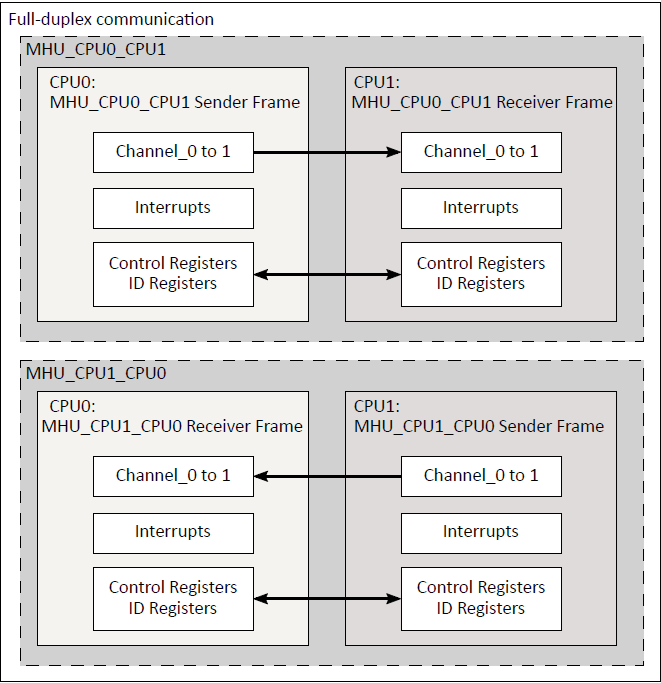

.. _appnote-mhu:

=====
MHU
=====

Introduction
=============

This document explains how to create, compile, and run a demo application for the Message Handling Unit (MHU).
The MHU provides point-to-point communication between the Secure Enclave processor, the Application processor (A32), and the two Real-Time processors (M55-HP and M55-HE).
It enables interrupt-based communication between these processing entities.

   MHU interface

.. include:: prerequisites.rst

Building MHU Application in Zephyr
========================================

Follow these steps to build the MHU application using the Alif Zephyr SDK:

1. For instructions on fetching the Alif Zephyr SDK and navigating to the Zephyr repository, please refer to the `ZAS User Guide`_

.. note::
   The build commands shown here are specifically for the Alif E7 DevKit.
   To build the application for other boards, modify the board name in the build command accordingly. For more information, refer to the `ZAS User Guide`_, under the section Setting Up and Building Zephyr Applications.

2. Build commands for applications on the M55 HE core:

.. code-block:: bash

        west build -p always -b alif_e7_dk/ae722f80f55d5xx/rtss_he ../alif/samples/drivers/ipm/ipm_arm_mhuv2/rtss_he -DRTSS_HP_MHU0=on

3. Build commands for applications on the M55 HP core:

.. code-block:: bash

        west build -p always -b alif_e7_dk/ae722f80f55d5xx/rtss_hp ../alif/samples/drivers/ipm/ipm_arm_mhuv2/rtss_hp -DRTSS_HE_MHU0=on

Once the build command completes successfully, executable images will be generated and placed in the `build/zephyr` directory. Both `.bin` (binary) and `.elf` (Executable and Linkable Format) files will be available.

Executing Binary on the DevKit
================================

To execute binaries on the DevKit follow the command

.. code-block:: bash

   west flash

Console Output
===============

The following console logs show the Minicom outputs for RTSS-HP and RTSS-HE MHU examples on the Alif E7 DevKit.

.. list-table::
   :header-rows: 1
   :widths: 50 50

   * - **Minicom - Port /dev/ttyUSB0**
     - **Minicom - Port /dev/ttyACM1**

   * - .. code-block:: text

          RTSS-HP RTSS-HE MHU 0 example on alif_e7_devkit
          MSG received is 0xdeaddeace
          data sent
          MSG received is 0xbeabdead
          data sent
          MSG received is 0xdeaddeace
          data sent
          MSG received is 0xbeabdead
          data sent
          MSG received is 0xdeaddeace
          data sent
          MSG received is 0xbeabdead
          data sent
          MSG received is 0xdeaddeace
          data sent
          MSG received is 0xbeabdead
          data sent
          MSG received is 0xdeaddeace
          data sent
          MSG received is 0xbeabdead
          data sent

     - .. code-block:: text

          RTSS-HE RTSS-HP MHU 0 example on alif_e7_devkit
          MSG received is 0xdeaddeace
          data sent
          MSG received is 0xbeabdead
          data sent
          MSG received is 0xdeaddeace
          data sent
          MSG received is 0xbeabdead
          data sent
          MSG received is 0xdeaddeace
          data sent
          MSG received is 0xbeabdead
          data sent
          MSG received is 0xdeaddeace
          data sent
          MSG received is 0xbeabdead
          data sent
          MSG received is 0xdeaddeace
          data sent
          MSG received is 0xbeabdead
          data sent

.. note::
   The logs above show successful message exchange between RTSS-HP and RTSS-HE cores through the MHU interface on the Alif E7 DevKit.

.. include:: west_debug.rst

